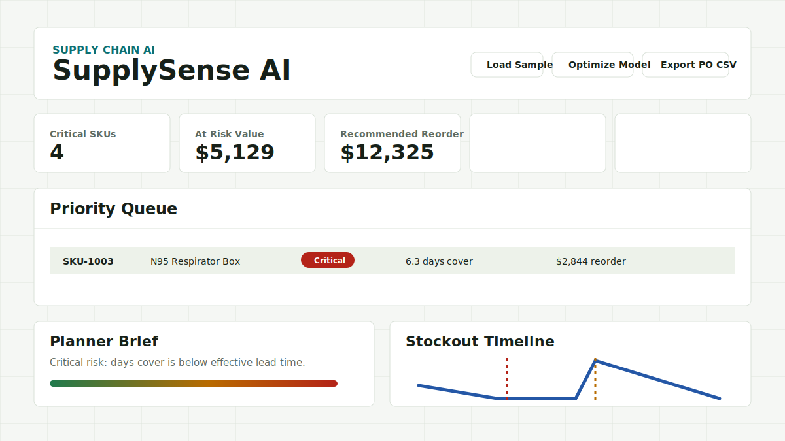

# SupplySense AI

SupplySense AI is an inventory risk and replenishment copilot for the Ignite64 Supply Chain AI track. It helps supply chain planners identify SKU-level stockout risk, understand supplier-driven delays, and generate replenishment actions before service levels are impacted.



## Problem

Inventory teams often rely on static spreadsheets and delayed reports. By the time a planner notices that a fast-moving SKU is running low, supplier lead time, open order uncertainty, and regional risk may already make recovery expensive.

## Solution

SupplySense AI turns operational inventory data into a prioritized decision queue. It combines current stock, recent demand, open orders, supplier lead time, reliability, average delay, defect rate, and regional risk to forecast stockout exposure and recommend reorder quantities.

## Features

- SKU-level stockout risk scoring
- Days of cover and effective lead time calculation
- Supplier risk scoring from reliability, delay, defect, and region signals
- History-informed calibration for safety buffer, supplier weight, and risk conservatism
- Data quality and calibration readiness checks for uploaded CSV files
- Downloadable CSV template for testing user-provided inventory data
- Two built-in demo datasets: medical supply and retail inventory
- Before/after comparison for baseline vs optimized planning outputs
- Recommended reorder quantity and estimated cash need with MOQ, pack size, and warehouse capacity constraints
- Planner workflow actions: Approve, Review, and Override
- Stockout timeline visualization for the selected SKU
- Planner-friendly natural language explanations
- Recommended purchase order CSV export
- Submission summary draft for hackathon reporting

## Demo Flow

1. Open `index.html` in a browser.
2. Choose `Medical demo` or `Retail demo`, click `Load Demo`, or upload a CSV with the same columns as the downloaded template.
3. Use `Download CSV Template` if you want to test your own SKU-level inventory file.
4. Review the top risk metrics, project value summary, and upload validation result.
5. Review the data quality and calibration readiness panel.
6. Click `Optimize Model` to tune risk assumptions from historical weekly demand.
7. Compare baseline and optimized planning outputs.
8. Select a high-risk SKU in the priority queue.
9. Read the planner brief and supplier risk explanation.
10. Use the stockout timeline to compare projected inventory against replenishment ETA.
11. Mark planner decisions as Approve, Review, or Override.
12. Export the recommended purchase order CSV with explanation reasons and order constraints.

## CSV Columns

```text
sku,name,category,current_stock,lead_time_days,supplier,on_order,last_14d_sales,unit_cost,supplier_reliability,avg_delay_days,defect_rate,region_risk,min_order_qty,pack_size,warehouse_capacity,hist_wk_8,hist_wk_7,hist_wk_6,hist_wk_5,hist_wk_4,hist_wk_3,hist_wk_2,hist_wk_1
```

The app validates row count, missing required values, and historical weekly demand coverage after each upload. The built-in datasets are synthetic demos; uploaded CSV files run through the same scoring, calibration, planner brief, timeline, and export logic.

## How It Works

SupplySense AI estimates daily demand from the last 14 days of sales, calculates days of cover from available inventory, then adjusts lead time using supplier delay and risk signals. The risk score increases when demand will exhaust inventory before replenishment can arrive, when supplier reliability is low, or when the recommended reorder quantity is large.

The app also calculates safety stock and target stock levels, then recommends a reorder quantity and estimated cash requirement. Recommended order quantities are adjusted for minimum order quantity, pack size, and warehouse capacity constraints. The `Optimize Model` control uses eight weeks of historical weekly demand to estimate demand volatility and tune the safety buffer, supplier risk weight, and risk score conservatism. For demo clarity, the model runs fully in the browser using JavaScript and demo CSV datasets.

The data quality panel checks required CSV fields, row count, and historical demand coverage before calibration. This reflects a real deployment concern: inventory planning models are only useful when SKU, inventory, order, demand, and supplier fields are complete enough to support decision making.

## Model Assumptions

The current demo uses synthetic inventory and supplier-risk data designed to simulate realistic supply chain planning scenarios. The scoring model is an interpretable heuristic based on common inventory planning concepts, including days of cover, lead time, safety stock, reorder quantity, and supplier reliability.

The `Critical`, `High`, `Watch`, and `Stable` thresholds are configurable demo assumptions, not fixed industry standards. The current optimization step demonstrates how historical demand can tune these assumptions. In a production deployment, calibration would use larger historical datasets, supplier performance records, target service levels, and business risk tolerance.

## Tech Stack

- HTML
- CSS
- JavaScript
- SVG-based timeline visualization
- CSV parsing and export in the browser

## AI Usage

AI assistance was used during development for ideation, interface copy, and implementation support. The project logic, demo dataset, and final implementation are included in this repository for review.

## Project Materials

- `docs/submission-summary.md`: 500-word hackathon submission summary draft
- `docs/demo-script.md`: 3-minute demo video script
- `data/sample_inventory.csv`: medical supply demo dataset
- `data/retail_inventory.csv`: retail inventory demo dataset

## Future Enhancements

- Add richer demand forecast methods
- Connect an LLM API for dynamic planner explanations
- Add supplier alternatives and second-source recommendations
- Add demand velocity comparison across categories
- Add authentication and persistent uploaded datasets
- Integrate ERP, WMS, POS, procurement, and supplier performance feeds
- Add backtesting for predicted vs actual stockouts, false alarms, adoption rate, and service-level impact
- Persist planner approvals, overrides, comments, and audit history
